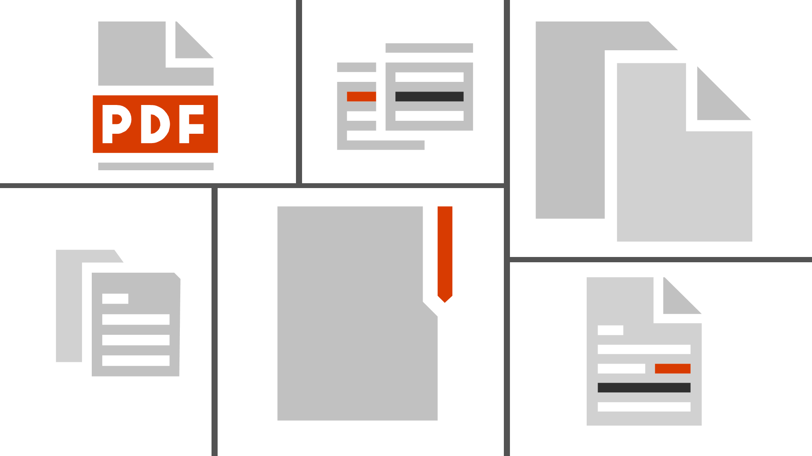

### Lesson Overview - Other Types of Documents
By default when you create a document in Word, it will be saved as a Word document, with the extension *.doc* or *.docx*. Text documents can also be saved as view-only files using the PDF file type.

In this lesson, you'll learn how to work with PDF files in Microsoft Word.

**By the end of this lesson you will be able to:**

*   Covert a Word document to the PDF format.
*   Edit a PDF file.

Keep the following **guiding questions** in mind as you complete this lesson. You should be able to answer them on your own at the end of the lesson:

1.  When might you want to save a document as a PDF file?
2.  How can you convert a document to PDF?
3.  How can you edit PDF files in Microsoft Word?

### Work with PDF Files
PDF is a view-only file format. That means you can't make changes to to a file while it's saved in the PDF format. It is a good idea to save documents as PDF files when they are complete and you do not anticipate them being editted by anyone else. For example, handouts and flyers are also saved as PDFs because they can easily be shared with others and printed.

**Watch the following video to learn how to save a document as a PDF file in Microsoft Word.**

#### Video - Save to PDF

> [!VIDEO https://www.microsoft.com/en-us/videoplayer/embed/RWer36]

### Try It Yourself

Follow the steps below to save a document as a PDF file:

1.  Select **File > Save As**.
2.  Select a folder to save your document in on your computer or in OneDrive.
3.  In the **Save As** text box, select **PDF (*.pdf)**.
4.  Select **Save**.

### Edit a PDF File
To edit a PDF file, you need first to convert it to a Word document. From there, you can make changes to the document and save it as a new PDF file.

**Watch the following video to learn how to edit PDF files in Microsoft Word.**

#### Video - Edit a PDF

> [!VIDEO https://www.microsoft.com/en-us/videoplayer/embed/RWfqt6]

