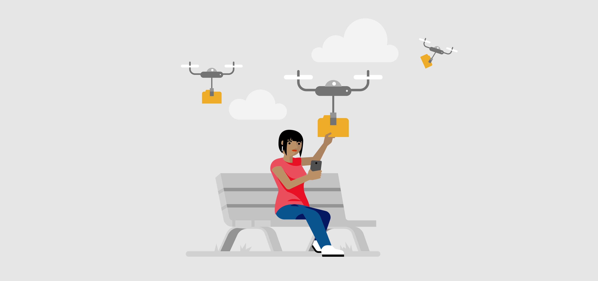

### Lesson Overview - Use the Cloud

Thanks to the Internet, we can store information from one device and access it using another, almost instantly. **The cloud** is a collection of software services that run across the world using the Internet, instead of running on a single user's computer.

Storing content on the cloud makes it easier to access our information from anywhere, instead of storing it locally, or only on our computer.

In this lesson, you will learn about the Cloud and how you can use it.

**By the end of this lesson you will be able to:**

*   Describe uses of cloud services like OneDrive
*   Sign in to OneDrive.
*   Use OneDrive from a mobile device
*   Create, upload, restore and share files using OneDrive

Keep the following **guiding questions** in mind as you complete this lesson. See if you can answer them on your own at the end of the lesson:

1.  What is the cloud?
2.  How does the cloud make it easier to store and share files?
3.  How can you use OneDrive to access your files from anywhere?

### Why Use the Cloud?

Cloud services, like Microsoft's OneDrive, help you store your files online, access them from any device, and share them with others.

**Watch the following video to learn about the benefits of storing files using cloud services like OneDrive.**

#### Video: Why Use OneDrive?
> [!VIDEO https://www.youtube.com/embed/9oTQqsBMb5U]

### Getting Started with OneDrive

OneDrive helps you store and manage your files in the Cloud from any device.

**Watch the following video to learn about the main features of OneDrive.**

#### Video: Intro to OneDrive
> [!VIDEO https://www.youtube.com/embed/itAxgxzHWSY]

### Sign in or Create an Account

To start using OneDrive and explore its features, you need an account. You can sign up for free if you don't have one.

**Watch the following video to learn how to sign in to OneDrive or create a new account.**

#### Video: Sign in or Create an Account
> [!VIDEO https://www.youtube.com/embed/dGeh97nrV_E]

### Try It Yourself

Now it's your turn to start with OneDrive. If you have a Microsoft account, sign in online. If you don't have an account, follow the steps to create one.

### Learn the Basics

In OneDrive, there are three areas to help you view and work with your files: the Navigation pane, the file list, and the toolbar. Once you become familiar with these areas, you'll be able to manage your files on OneDrive.

**Watch the following video to learn the basics of using OneDrive.**

#### Video: Learn the Basics
> [!VIDEO https://www.youtube.com/embed/NRMTnyzpJO8]

### Set Up OneDrive on Your Phone or Tablet

If you can access your files on your phone or mobile device, you will be able to work wherever you are.

**Watch the following video to learn how to setup OneDrive on your phone.**

#### Video: Set Up OneDrive on Your Phone or Tablet
> [!VIDEO https://www.youtube.com/embed/q-CSFF-aKR0]

### Use the OneDrive Mobile App

With the OneDrive app on your mobile device, you can access your files wherever you are.

**Watch the following video to learn how to use the OneDrive app on a mobile device.**

#### Video: Use the OneDrive Mobile App
> [!VIDEO https://www.youtube.com/embed/k7scIjJRzH4]

### Try It Yourself

**Challenge:** Create a file on your OneDrive mobile app and access it online from another computer.

### Upload Files and Folders

When you upload files to OneDrive, you can securely update and share them from anywhere.

**Watch the following video to learn how to upload files and folders to OneDrive.**

#### Video: Upload Files and Folders
> [!VIDEO https://www.youtube.com/embed/iPRcP5lBwOU]

### Try It Yourself

**Challenge:** Move a file from your desktop to a OneDrive folder. Then, log into OneDrive online or on a mobile device. Verify that you can access the uploaded file.

### Create Files and Folders

Just as you can upload existing files and folders to OneDrive, you can also create new ones.

**Watch the following video to learn how to create files and folders in your OneDrive account.**

#### Video: Create Files and Folders
> [!VIDEO https://www.youtube.com/embed/3XrIKGcFX1E]

### Restore Deleted Files

If you deleted a file by mistake, don't worry. With OneDrive, you can **restore** deleted files.

**Watch the following video to learn how to restore deleted files in OneDrive.**

#### Video: Restore Deleted Files
> [!VIDEO https://www.youtube.com/embed/qaMYe87vJCc]

### Share Files and Folders

With your files in OneDrive, you can share them with others, control who can view or edit them, and work together at the same time.

**Watch the following video to learn how to share files and folders and how to manage permissions.**

#### Video: Share Files and Folders
> [!VIDEO https://www.youtube.com/embed/2prSXUjGfTE]

### Try It Yourself

Follow the steps below to practice sharing documents with OneDrive:

*   Create a new file.
*   Share it with your friends.
*   Ask everyone to write down a suggestion for a place you should visit on the weekend.
