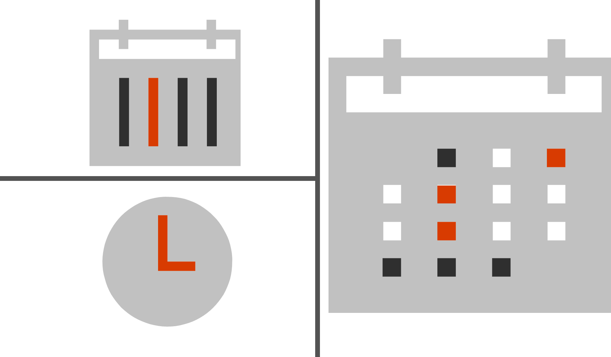

### Lesson Overview - Manage Time with a Digital Calendar

Digital calendars are a great way to keep track of meetings and tasks on your own or with the people you work with.

In this lesson, you will learn about Outlook Calendar, the calendar feature of the Outlook mail app.

**By the end of this lesson you will be able to:**

*   Create appointments and meetings.
*   Search for an item in your calendar.
*   Use categories and reminders.

Keep the following **guiding questions** in mind as you complete this lesson. See if you can answer them on your own at the end of the lesson:

1.  How can you keep track of meetings and appointments using Outlook?
2.  How can you organize and label your appointments and meetings and Outlook?
3.  How can you use Outlook to remember when you have an upcoming meeting or appointment?

### Meet Outlook Calendar

Outlook calendar helps you keep track of your appointments and meetings.

**Watch the following video to learn more about Outlook Calendar.**

#### Video: Meet Outlook Calendar
> [!VIDEO https://www.youtube.com/embed/yK0rZZHYgQg]

### Try It Yourself

Open Outlook calendar and practice swtiching between the **day**, **week**, or **month** views.

### Create Appointments and Meetings

You can use Outlook to keep track of your personal appointments, or schedule meetings with other people.

**Watch the following video to learn how to schedule meetings and appointments in your Outlook calendar.**

#### Video: Create Appointments and Meetings
> [!VIDEO https://www.microsoft.com/en-us/videoplayer/embed/RWfzsI]

[Full screen view](https://www.microsoft.com/en-us/videoplayer/embed/RWfzsI?pid=ocpVideo0-innerdiv-oneplayer&postJsllMsg=true&maskLevel=20&market=en-us)

### Search your Calendar

You can search your calendar to quickly find events and meetings that you've added.

**Watch the following video to learn how to search your Outlook calendar.**

#### Video: Search your Calendar
> [!VIDEO https://www.youtube.com/embed/YYlD7VtwCAE]

### Use Calendar Categories and Reminders

With color categories and reminders, Outlook keeps your calendar organized so you don't miss important meetings or appointments.

**Watch the following video to learn how to use calendar categories and reminders.**

#### Video: Use Calendar Categories and Reminders
> [!VIDEO https://www.youtube.com/embed/iRwqfhtYDpo]