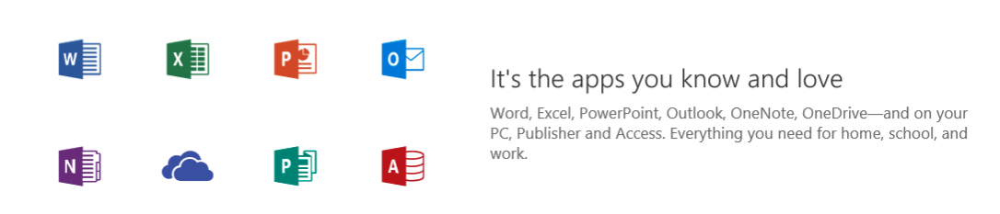

Microsoft Office is a package of software applications that makes it easy for you to be productive as you accomplish everyday tasks on your computer. In this lesson, you will be introduced to Microsoft Office and learn how you can use it for productivity in your daily work and personal activities.

**By the end of this lesson you will be able to:**

*   Describe the basic benefits of Microsoft Office.
*   Differentiate between Office 2016 and Office 365
*   Sign in to Office Online.

Keep the following **guiding questions** in mind as you complete this lesson. You should be able to answer them on your own at the end of the lesson:

1.  What is Microsoft Office?
2.  What can I use Microsoft Office for?
3.  How can I access Microsoft Office?

### Intro to Microsoft Office
The Microsoft mission is to empower every person and every organization on the planet to achieve more. Microsoft Office was created to help people be more productive and achieve more every day.

Microsoft Office includes popular productivity apps like Word for working with documents, Excel for working with spreadsheets, PowerPoint for working with presentations, Outlook for email, and more.

**Watch the following video to learn what's possible with Microsoft Office.**

#### Video: Why Office?
> [!VIDEO https://www.youtube.com/embed/9z0zKaDb1PQ]

**There are several ways to access and use the Office apps. Watch the following video to learn the difference between Office 2016, Office 365 and Office Online.**

#### Video: Office 365 vs. Office 2016 
> [!VIDEO https://www.youtube.com/embed/t1vD6qwQJWE]

### Office Online
Office Online gives you the flexibility to work anywhere, at any time and on any device you have, so you can be productive all the time. With Office Online, you can access the Office apps online for free.

**Watch the following video to learn more about Office Online.**

#### Video: Introduction to Office Online
> [!VIDEO https://www.youtube.com/embed/vQQisVhKXqg]
