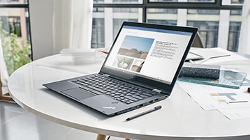

You can do a lot with Microsoft Word when you know how to add and edit text, and insert and format objects. There are several additional features of Microsoft Word that can make it easier to create digital content.

In this lesson you will learn how to use some of these featuers so you can feel more proficient as you create documents.

**By the end of this lesson you will be able to:**

*   Add page numbers to documents
*   Apply themes to documents
*   Add equations
*   Use the "tell me" feature of Word to access any feature
*   Use Word on a mobile device

Keep the following **guiding questions** in mind as you complete this lesson. You should be able to answer them on your own at the end of the lesson:

1.  What can you do when you don't know where to find a certain feature of Microsoft Word?
2.  How can you access your Word documents when you're not at your desktop or laptop computer?

### Add Page Numbers
With Microsoft Word, you can add page numbers to your document using a variety of styles.

**Watch the following video to learn how to add page numbers to a Microsoft Word document.**

#### Video - Add Page Numbers

> [!VIDEO https://www.microsoft.com/en-us/videoplayer/embed/RE1SU1d]

### Try It Yourself

**Challenge:** Try to add page numbers to the bottom right corner of your document.

### Apply Themes to Documents
You can apply a theme to quickly format an entire document with a specific style. There are a variety of themes to choose from in Microsoft Word. These can save you a lot of time so you don't have to format the styles of your document manually. 

**Watch the following video to learn how to apply a theme to a document.**

#### Video - Apply Themes

> [!VIDEO https://www.microsoft.com/en-us/videoplayer/embed/RWee2k]

### Use Tell Me to Do Anything in Office
Sometimes, you might forget which feature you need to use in Microsoft Word, The "Tell Me" feature helps you get things done faster by helping you find the features you need to use.

**Watch the following video to how to use Tell Me feature to get things done faster in Microsoft Word.**

#### Video - Tell Me Feature

> [!VIDEO https://www.microsoft.com/en-us/videoplayer/embed/RWe8Qx]

### Try It Yourself

Now it's your turn. Try to use "Tell Me" feature on your document.

### Use Word on a Mobile Device
In addition to using Word on your desktop or laptop computer, you can install the Mobile app. With Word on a mobile device, you can access and edit your documents and stay productive on the go. 

**Watch the following video to learn about using Microsoft Word on a mobile device.**

#### Video - Word on a Mobile Device

> [!VIDEO https://www.microsoft.com/en-us/videoplayer/embed/RWee2l]

### Try It Yourself

**Challenge:** If you have a mobile device, download the Word app, sign in and open your most recent document.

### Write an Equation
Equations are written in a specific formulas different from the regular text. MS Word helps you to write equations in an easy way.

**With this video, you will learn how to add equations to your document.**

#### Video - Add an Equation

> [!VIDEO https://www.microsoft.com/en-us/videoplayer/embed/RWe8JV]

### Try It Yourself

*   Now it's your turn. Try to add an equation on your document using a your mouse.

