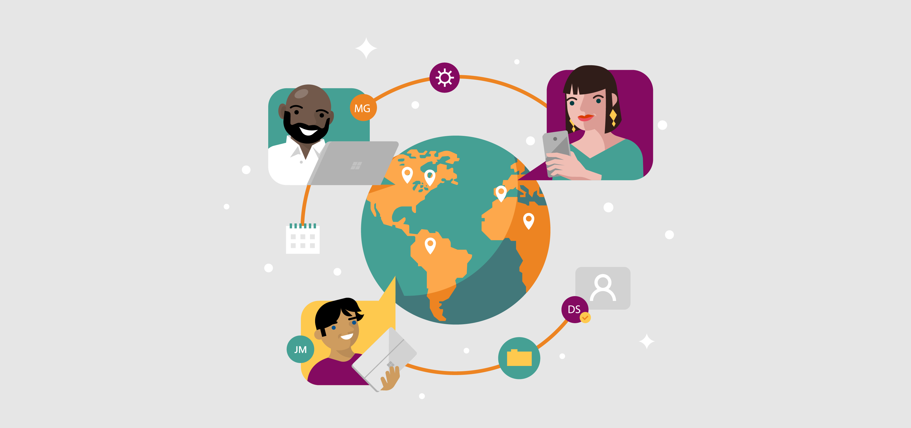

### Lesson Overview - Online Civility
We can use the Internet to access lots of information and communicate with others, but we have to make sure we're behaving as responsible digital citizens.

In this lesson, you will learn how to responsibly use the Internet and the Web.

**By the end of this lesson, you will be able to:**

*   Describe the rights that people have to information and content shared on the Web
*   Describe best practices for using information found on the Web
*   Describe the implications of treating others poorly on the Web

Keep the following **guiding questions** in mind as you complete this lesson. See if you can answer them on your own at the end of the lesson:

1.  What should you do when you want to use information that you find online?
2.  What can you do to prevent or end cyberbullying?

### Use Information Responsibly
Although accessing information is easy in the digital world, there are some rules to keep in mind when you want to use information you find online.

**Watch the following video to learn some of the  guidelines for using information that you find online.**

#### Video: Use Information Responsibly
> [!VIDEO https://www.youtube.com/embed/N88MCpmfENg]

### Cyberbullying
The Internet allows us to connect with others online from all across the world. Unfortunately, people don't always treat each other nicely online.

**Cyberbullying** is a type of bullying that takes place over the Internet. It can be easy to send mean messages or spread negative rumors about other people, but this can be dangerous for the person who is targeted.

**Watch the following video to learn tips for preventing cyberbullying and being a digital citizen.**

#### Video: Treat Others Respectfully Online
> [!VIDEO https://www.youtube.com/embed/fr_PdkewdZc]