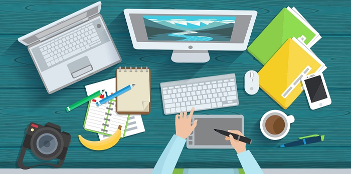

### Lesson Overview - Interact with a Computer

There are many types of computers that are used for everyday tasks.

In this lesson, we'll explore what a computer is, the parts of a computer and how to interact with a computer.

**By the end of this lesson you will be able to:**

*   Describe the functions of a computer.

*   Differentiate between computer hardware and software.

*   Describe the primary parts of a computer and the use of each part.

*   Describe the various types of modern personal computing devices and their uses.

Keep the following **guiding questions** in mind as you complete this lesson. See if you can answer them on your own at the end of the lesson:

1.  What are the primary functions of a computer?

2.  What is the difference between computer hardware and software?

3.  What are the primary hardware parts that make up a computer?

4.  What are the common types of personal computing devices?

### What is a Computer
Nowadays, computers are everywhere and we are using them for a variety of tasks. There are various types of computers that have changed how we live in many ways.

**Watch the following video to learn more about computers.**

#### Video: What is a Computer?
> [!VIDEO https://www.youtube.com/embed/Mqzd9CcxWwc]

### Parts of a Computer

A computer consists of many hardware components.  Although there are various types of computers, all computers contain a similar set of hardware parts.  Each of these hardware parts help us use and interact with the computer in some way.

**Watch the following video to learn about the hardware components that make up a computer.**

#### Video: Parts of a Computer
> [!VIDEO https://www.youtube.com/embed/QvWP9h3CZdk]

### Types of Personal Computers

Computers come in many shapes and sizes.  Each type has its own advantages and disadvantages that make it suitable for certain uses and scenarios.

**Watch the following video to learn about the types of personal computers, their differences and their uses.**

#### Video: Types of Personal Computers
> [!VIDEO https://www.youtube.com/embed/_mKFdGNf4-E]