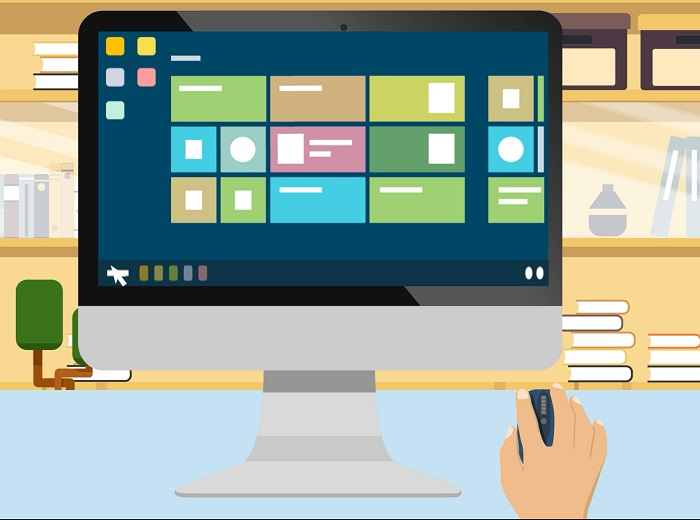

In this lesson, you will learn how to operate a computer to perform basic tasks.

**By the end of this lesson, you will be able to:**

*   Describe the role of an operating system.
*   Navigate the Windows 10 operating system.
*   Organize files and folders in Windows 10.
*   Use the right-click to access system features.
*   Customize your operating system desktop.

Keep the following **guiding questions** in mind as you complete this lesson. See if you can answer them on your own at the end of the lesson:

1.  What is an operating system? Provide an example of a popular operating system.
2.  What are the primary parts of the operating system that you use to get things done?
3.  How do files and folders help you organize things on your computer?
4.  What does the right-click feature of an operating system help you do?
5.  What parts of your operating system can you customize to your preferences?

### Intro to Operating Systems
The operating system is the conductor of the computer. It coordinates the software and hardware parts of the computer, making sure all of the different components work together to get things done.

There are many operating systems provided by many companies in the world. Each operating system is designed to work on specific types of devices. For example:

*   **Windows** is designed by Microsoft. It is a family of operating systems that can run on a variety of PCs and laptops. We will use the Windows 10 version of this operating system for demos in this course.
*   **MacOS** is designed by Apple Inc. and works on Apple's Macintosh computers like the MacBook.
*   **iOS** is designed by Apple Inc. and works on Apple's mobile devices like iPhone, iPod and iPad devices.
*   **Android OS** is designed by Google and works mainly on touchscreen mobile devices like smartphones and tablets.
*   **Google Chrome OS** is designed by Google and works on Chromebook devices.

**Watch the following video to learn about operating systems.**

#### Video: What is an Operating System?
> [!VIDEO https://www.youtube.com/embed/R1y4PJHB72E]

### Get to Know the Operating System
Let's explore the basics of working with an operating system.  We'll use the Windows 10 operating system for examples, but these concepts carry over to other operating systems too. 

**Watch the following video for an overview of the Windows 10 operating system.**

#### Video: Navigate your OS
> [!VIDEO https://www.youtube.com/embed/sQjg6ArFOKo]

## Try It Yourself

**Challenge:** Open the calculator application on your computer.

### Work with Files and Folders
Operating systems are designed to help us work in ways that we're used to.  Just as we work with physical documents, we can create files and folders to store information on a computer.

**Watch the following video to learn how to work with files and folders on your computer.**

#### Video: Work with Files and Folders
> [!VIDEO https://www.youtube.com/embed/YEi1oS8Pl7g]

## Try It Yourself

Customize your file explorer view.

1.  Open the file explorer on your computer
2.  Change between the various view options (use the **View** menu)
3.  Choose the view you prefer

### Understand the Right Click
Computer hardware and software work together to help us use the computer effectively.  One example of this is the mouse and the operating system.  We use the primary left-click button of the mouse to perform most operations on the computer.  The right-click button has helpful functions that help us access addtional features of our software.

**Watch the following video to learn more about the right click and its functions.**

#### Video: Understanding the Right Click
> [!VIDEO https://www.youtube.com/embed/FZWacClL9P4]

## Try It Yourself

Right-click anywhere on your desktop.  What options are available? What do you think these options can be used for?

### Work with Windows
As you use an operating system, you will often be working with many different things at once.  The operating system keeps different activities in different views, called "windows". 

**In this video, you will learn about application windows and how to deal with them.**

#### Video: Work with Windows
> [!VIDEO https://www.youtube.com/embed/tleQdrk7nOA]

### Personalize your Desktop
There are many features and settings that you can customize within your operating system based on your preferences.  These personalizations can make it easier for you to get things done on your computer.

**Watch the following video to learn how to customize your operating system prefences.**

#### Video: Personalize Your Desktop
> [!VIDEO https://www.youtube.com/embed/oN7Pzt9Qzlk]

## Try It Yourself

**Challenge:** Modify the preferences on your computer to change the color scheme to a theme of your choice.

### Use Virtual Assistants
Virtual assistants are digital services that help you to perform tasks on your computer, like setting reminders, checking the weather, and searching the web.  Virtual assistants are built into the operating systems of many modern devices.  Some of the most popular virtual assistants are Microsoft Cortana, Apple Siri and Google Assistant.

Virtual assistants use AI or artificial intelligence to learn more about you, so they become more helpful the more you continue to use them. You can use virtual assistants on your desktop, laptop, tablet, smartphone or other supported devices such as smart speakers.  To make interactions easier, you can often interact with virtual assistants using voice commands.

**Watch the following video to learn how to use the Cortana virtual assistant on a Windows 10 computer.**

#### Video: Use Cortana with Windows 10
> [!VIDEO https://www.youtube.com/embed/-wgsB8EliTo]

## Try It Yourself

**Challenge:** Using the virtual assistant on your device, set a reminder for yourself to smile in 5 minutes.

### Use Accessibility Features
There is no limit to who can use a computer thanks to modern computers that are designed with the needs of everyone in mind.  Computer operating systems are designed with many built-in **accessibility tools and features** that help people with disabilities like limited vision or or limited hearing use their computers more easily.  In addition to built-in features, there are various programs that can be installed to add more functionality for increased accessibility.  

**Watch the following video to learn about some of the accessibility features that are helpful for users of Windows 10 computers.**

#### Video: Use Accessibility Features in Windows 10
> [!VIDEO https://www.youtube.com/embed/iorIEr4oFsk]

