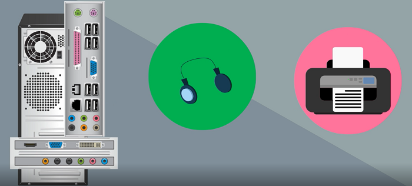

### Work with Connected Devices

Computers are built with the hardware that is necessary for the computer to operate at a basic level. However, there are times when you might want to add functionality to your computer by connecting an external device.

These types of devices are called **peripheral** devices. They add functionality to your computer by providing **input** functions and/or **output** functions. An example of an input device is a keyboard, which allows a user to type information, or a scanner, which allows a user to scan a photo for the computer focus. An example of an output device is a speaker that outputs sound from the computer to the user, or a monitor, which outputs visual information to the user.

In this lesson, you will learn how to connect peripheral devices to your computer.

**By the end of this lesson you will be able to:**

*   Describe types of peripheral devices and their uses
*   Use portable storage devices
*   Connect Bluetooth devices to a computer

Keep the following **guiding questions** in mind as you complete this lesson. See if you can answer them on your own at the end of the lesson:

1.  What is the role of peripheral devices?
2.  How can you increase the storage capacity of your computer using a peripheral device?
3.  How can you connect a device to your computer wirelessly?

### Portable Storage Devices

Sometimes you need to enhance the storage abilities of your computer.  You can connect **portable storage devices** like USB drives and external hard drives to your computer for additional storage.  These devices also make it easy to transfer files from one device to another.

**Watch the following video to learn more about portable storage devices.**

#### Video: Connect a Portable Storage Device in Windows 10
> [!VIDEO https://www.youtube.com/embed/6EgmulTT5hc]

### Bluetooth Devices

With modern technology, we can connect peripheral devices to our computers without using cables.  Bluetooth is a wireless technology that makes this possible.  If a device is bluetooth enabled, you can connect it to a bluetooth enabled computer with the press of a button.

Using bluetooth, you can connect wireless headphones to your computer and listen to music without plugging anything in, or connect a keyboard to your computer without any cables.  You can even connect both via Bluetooth at the same time.

Many laptops and tablets have Bluetooth support built-in.  If you're using a computer that doesn't have Bluetooth, you can plug a separate USB Bluetooth adapter into the USB port to enable Bluetooth.

**Watch the following video to learn how to connect a Bluetooth device to your Windows 10 computer.**

#### Video: Connect a Bluetooth Device in Windows 10
> [!VIDEO https://www.youtube.com/embed/vlxTIxHgkrc]