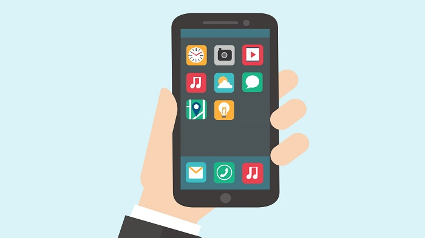

Applications, also known as apps, are software programs that we can use to get things done on our computers. Every day, new applications are developed to solve new problems around the world.

In this lesson, you'll learn more about apps, what types of applications you can use, and how to work with applications on your computer.

**By the end of this lesson, you will be able to:**

*   Describe the concept of an application.
*   Choose the right application for your needs.
*   Understand the similarities between different applications.
*   Work with applications on your computer

Keep the following **guiding questions** in mind as you complete this lesson. See if you can answer them on your own at the end of the lesson:

1.  What is an application, or an app?
2.  What's the difference between an application and an operating system? How do they work together?
3.  What types of applications are there?
4.  How can you learn to use new applications?

